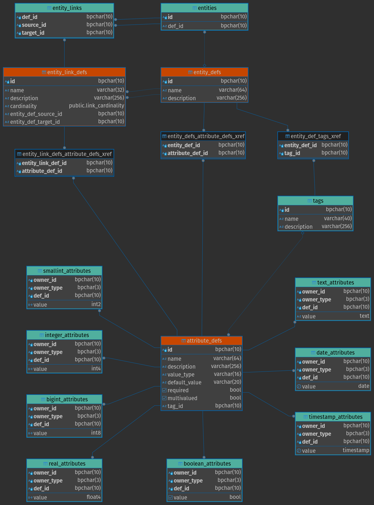

# Akasha

A generic ecosystem of knowledge and behavior.

Currently, the focus is on the knowledge: the structure (of entities with their attributes) and links (between entities). 
Later, the behavior will be introduced through a pluggable mechanism. Most probably, a WASM based server side implementation.

---

Its initial triggers were three needs for having a:

-   Service Registry
    -   exposing API for apps and services to self register
    -   and for service discovery, so that clients can know where to reach apps and services
-   Service Catalog
    -   that shows the list of all the apps and services that exist in your infrastructure
    -   including various (and relevant) details about them, based on their self published metadata
    -   their dependencies
    -   their deployments

 

## Prerequisites & Setup

The followings are the required tools and steps to have the proper setup for the app to run.

### Front-end related

Note: These are needed during development. In other words, if you don't change any code in the components (within `rsx` blocks), then there is no need to run the Tailwind CSS compiler in parallel with the back-end.

1. Install [npm](https://docs.npmjs.com/downloading-and-installing-node-js-and-npm).
2. Install the Tailwind CSS [CLI](https://tailwindcss.com/docs/installation).
3. Start the Tailwind CSS compiler using `./run_css.sh` script.

### Back-end related

Have `rust` installed using [rustup.rs](https://rustup.rs/).

 

### Run

Launch the app using `./run-dev.sh`.

In case of compilation error that remain hidden behind Dioxus CLI, run `cargo check --features server,web` to reveal them.

For further development, as previously mentioned, make sure you have `./run_css.sh` running, to pick up the newly used Tailwind CSS utility classes.

 

### The Domain Model

